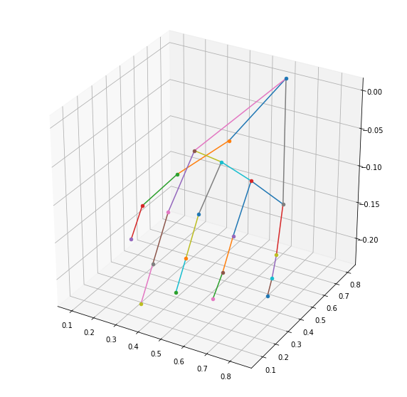
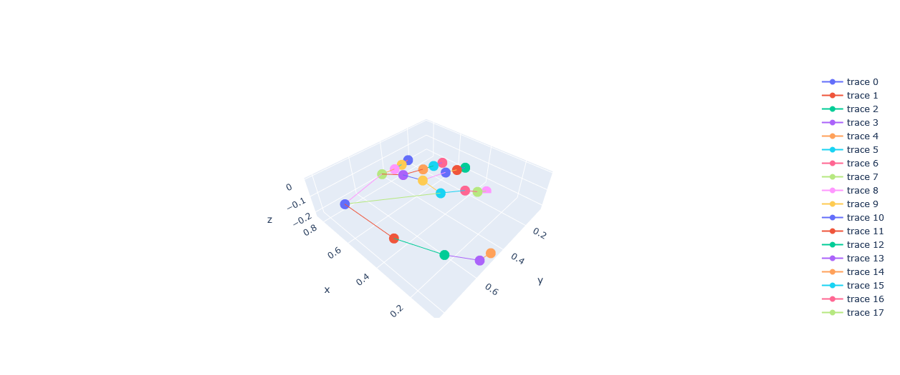

LSM MediaPipe
=============

Proyecto de Servicio Social en IIMAS UNAM, dirigido por Oscar Alejandro Esquivel Flores

Graficacion y procesamiento de la biblioteca media pipe para el analisis de los datos de una imagen.

## Image Hand Detection

Deteccion de 21 puntos de la mano en un espacio de tres dimensiones.

      python3 src/hand_picture.py img/hand1.jpg

## Ejemplo

Partiendo de una imagen de una mano derecha de palma, procesamos la imagen con media pipe, obtenemos el plano con los puntos y graficamos.

 

## Graficacion con matplotlib

Graficamos la mano con una de la bibliotecas mas populares en python, el resultado es una perspectiva unica en 3 dimensiones de la mano rotada.

## Graficacion con plotly

Plotly es una biblioteca de graficos open source el cual nos permite rotar el modelo de la mano de media pipe con una vista de 360°.

## Graficacion con media pipe

Media pipe tiene su propia graficacion del resultado del procesamiento de la imagen de manera nativa en la biblioteca.

## Extraccion de caracteristicas

Algunos ejemplos de extraccion de caracteristicas se pueden encontrar en hand.py, como el analisis geometrico de la mano a partir de matrices, distancias, medidas de tendencia central, etc.
